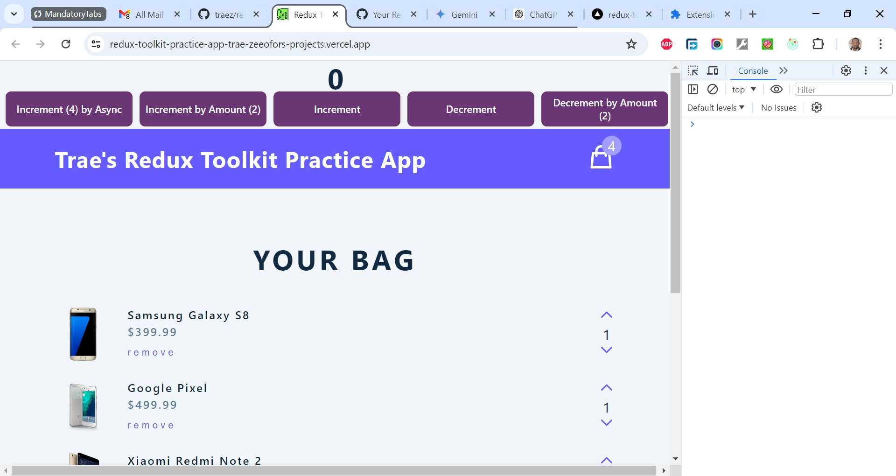

# Redux Toolkit Practice App

This is a combined solution to [Redux Toolkit Tutorial – JavaScript State Management Library Project](https://www.youtube.com/watch?v=bbkBuqC1rU4) and [Redux - Complete Tutorial (with Redux Toolkit) Project](https://www.youtube.com/watch?v=5yEG6GhoJBs&t=1s). I'm practicing and developing my coding competency by building projects after projects.

## Table of contents

- [Overview](#overview)
  - [The challenge](#the-challenge)
  - [Screenshot](#screenshot)
  - [Links](#links)
  - [My process](#my-process)
  - [Built with](#built-with)
  - [What I learned](#what-i-learned)
  - [Continued development](#continued-development)
  - [Useful resources](#useful-resources)
  - [Author](#author)
  - [Acknowledgments](#acknowledgments)

## Overview

### The Challenge/User Stories

Learn how to use Redux Toolkit in this course for beginners. Redux Toolkit is from the Redux team and it is intended to be the standard way to write Redux logic. So if you want to learn Redux to help with state management, this is the video for you.

In this video we will learn about Redux and Redux Toolkit. Redux is a state management library that makes it really easy to have global state in your React application. We are going to learn how to work with modern Redux, using Redux Toolkit to save ourselves some boilerplate code. This is the last video you will ever have to watch on Redux with Redux Toolkit! Enjoy!

### Screenshot

### Links

- Solution URL: [https://github.com/traez/redux-toolkit-practice-app](https://github.com/traez/redux-toolkit-practice-app)
- Live Site URL: [https://redux-toolkit-practice-app-trae-zeeofors-projects.vercel.app/](https://redux-toolkit-practice-app-trae-zeeofors-projects.vercel.app/)

## My process

### Built with

- Semantic HTML5 markup
- CSS custom properties
- Flexbox and CSS Grid
- Mobile-first workflow
- [React](https://reactjs.org/) - JS library
- [Next.js](https://nextjs.org/) - React framework**
- Tailwind CSS**
- Typescript**
- Nodejs (with/without Expressjs)
- MongoDB**  
- GraphQL**    
- Redux Toolkit 

### What I learned
 
- **Redux** itself is a standalone JavaScript library for managing application state. Redux is not specific to React and can be used with various frontend frameworks.  
- To get started, install ``@reduxjs/toolkit` and `react-redux`.  
- `useSelector` in Redux Toolkit and `useContext` in the Context API both allow React components to access state. `useSelector` extracts specific parts of the Redux state with a selector function, optimizing performance by re-rendering only when the selected state changes. `useContext` provides the entire context value, which can lead to less efficient updates if the context changes frequently. Redux Toolkit supports complex state management with middleware and enhancers, making it suitable for larger applications. The Context API is best for simpler state management needs. Choose Redux for advanced features and Context for straightforward state sharing.
- `useDispatch` is a hook provided by the `react-redux` library that allows functional React components to interact with the Redux store by dispatching actions. `useDispatch` is essential for interacting with the Redux store from within your React components, enabling you to update the state based on user actions or other events.
- **Payloads** in Redux Toolkit serve a similar purpose to arguments in functions. They provide the data needed to perform an operation or update.  
- **Actions** are used to tell Redux what it should do to the state. They are plain JavaScript objects that signal events or changes to the application state (e.g., increment, decrement, incrementByAmount). They act as messengers, carrying information from your components to the Redux store, which triggers updates to the state based on the action type. Actions in Redux Toolkit are automatically generated when using `createSlice`.  
Action Creators are functions that return an action object.  
Action Types are constants that represent the action.  
Dispatching Actions is done using the dispatch function in your components.  
- **Reducers** take action and get the job done in the Redux store. They also use payload if provided. Reducers never directly mutate the state. They make a copy of the state, change the copy, and then make the copy the new permanent state, just like in `useState`.  
- `createSlice` in Redux Toolkit, as the name implies, creates slices (manageable pieces) of state in your Redux app. It reduces boilerplate by auto-generating action types and creators. It simplifies reducers with the Immer library for easier, immutable updates. It takes initial state, slice name, and reducer functions as input and outputs a slice object with actions and a reducer for the slice.
- `extraReducers` in Redux Toolkit is an optional configuration within `createSlice`. It lets you handle actions from outside the slice. It's useful for handling actions from thunks (async logic) or other slices. It takes a function that receives a builder object. The builder provides methods like `addCase` to define reducers for specific actions. It enables responding to async actions like `pending`, `fulfilled`, and `rejected` from `createAsyncThunk`.
- The **"builder"** in Redux Toolkit refers to an object passed to functions like `createReducer` and used within `extraReducers` of `createSlice`. It provides methods to define how reducers handle actions. It offers functions like:  
`addCase` (Creates a reducer for a specific action type)  
`addMatcher` (Creates a reducer that matches actions based on a custom function)  
`addDefaultCase` (Defines a catch-all reducer for unmatched actions)  
It enables a builder pattern for clear and concise reducer logic and is often used with Immer for easier and safer state updates.
- `addCase` in Redux Toolkit is used within `createReducer` or `extraReducers` (of `createSlice`). It defines a reducer function for a specific exact action type. It takes two arguments (listed below) and It's key for handling specific actions and updating state accordingly:  
The action creator function (or action type string) to handle.  
The reducer function that updates state based on the action's payload.  
- **Todo**: Learn in depth how to set up and use Redux Toolkit's "**RTK Query**" data fetching functionality.
Tutorial link: https://redux-toolkit.js.org/tutorials/rtk-query
Project link: Frontend Mentor Clock app https://www.frontendmentor.io/challenges/clock-app-LMFaxFwrM  

### Continued development

- More projects; increased competence!

### Useful resources

Stackoverflow  
YouTube  
Google  
ChatGPT

## Author

- Website - [Trae Zeeofor](https://github.com/traez)
- Twitter - [@trae_z](https://twitter.com/trae_z)

## Acknowledgments

-Jehovah that keeps breath in my lungs
